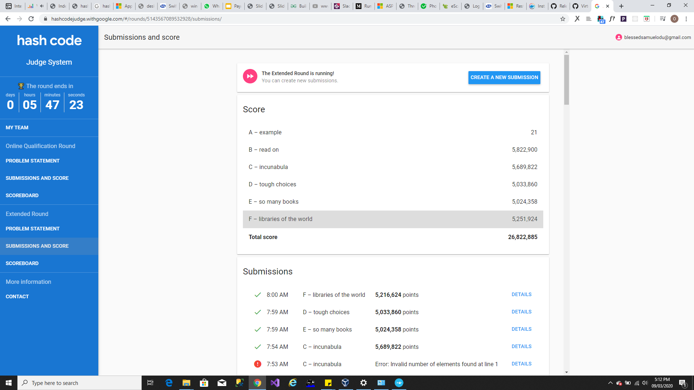
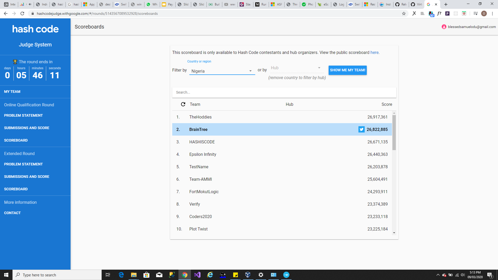
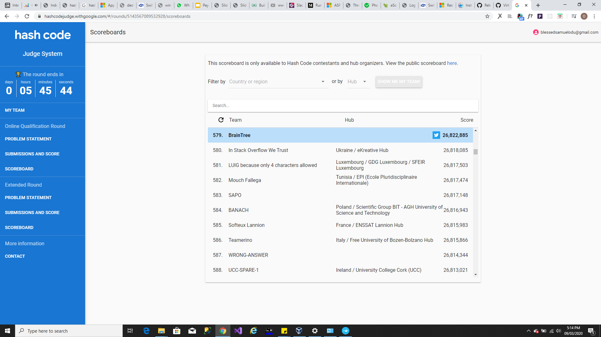

# Google-HashCode-2020(Qualification Round)
Hash Code is a team programming competition, organized by Google, for students and professionals around the world. You pick your team and programming language and we pick an engineering problem for you to solve. This year’s contest kicks off with an Online Qualifications, where your team can compete virtually from wherever you’d like, alongside your virtual Hub. Top teams will then be invited to compete from our virtual World Finals.

# Team
## Name:
**BrainTree**
## Participants
- [Odudimu Samuel(github@sirmeeLynx)](https://github.com/sirmeelynx)
- [Ahmed Olanrewaju(github@ahmzyjazzy)](https://github.com/Ahmzyjazzy)

# Problem Statement
Given a description of libraries and books available, plan which books to scan from
which library to maximize the total score of all scanned books, taking into account that
each library needs to be signed up before it can ship books.

[Book Scanning(pdf)](https://docs.google.com/viewer?url=https://storage.googleapis.com/coding-competitions.appspot.com/HC/2020/hashcode_2020_online_qualification_round.pdf)

# Solution 
## Explanation
- Our Book Scanning algorithm assigns priority to each libraries based on criterias and constraints highlighted in the problem statement.
- Libraries are then processed in order of their priorities(i.e from Highest to Lowest)
- The priorities are assigned to libaries based on factors such as bookWeight, noOfSignUpDays and bookDispatchRate.
- The bookWeight of a library is determined by taking the sum of scannable books with higher scores.
- So how do we ensure the **K** books we pick are the top **K** books ? Simple, by sorting book scores in descending order. i.e `books = books.sort((a, b) => bookScores[b] - bookScores[a]);`
- A book is considered scannable as long as it is available for scanning within the given scanning days.
- Our algorithm calculates Scannable books per library with the expression `let totalBooks = (noOfBookShippingDays * (noOfScanningDays - noOfBookSignupDays));`
- Obviously, scannable books must not exceed the total number of books in the library and the following expression `
        totalBooks = Math.min(books.length, totalBooks);` ensures that.
- Having done all that, bookWeight is then calculated by taking a sum of the scannable books i.e `books.slice(0, totalBooks).reduce((a, b, i) => ((i == 1) ? bookScores[a] : a) + bookScores[b]);`
- **bookDispatchRate** on the other hand was an experimental factor that seemed to positively affect the outcome of dataset 'f'
- To maximize the amount of bookscanned, the SignUp days must be reduced hence its fair to conclude that assigned priorities 
  must be inversely proportional to library signUp days.
- The following expression shows how library priority is calculated `let priority = (bookWeight * bookDispatchRate) / noOfBookSignupDays;`

For more information checkout the [API documentation](/documentation/global.html) of our solution.

## Try It Out
make sure you have [node](https://nodejs.org/en/download/) installed in your environment.
Run `npm start` on your cli.

# Result
## Points Scored

## Score Rank in Nigeria

## Score Rank in the World
